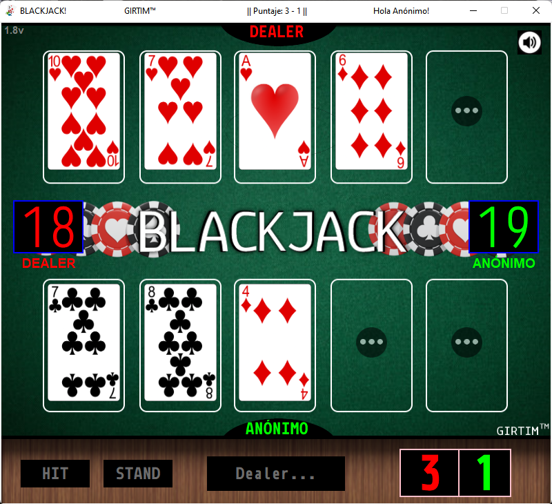

# Blackjack - A simple blackjack game with GUI

This project is a simple game of blackjack that I made to learn more about **Tkinter** and **Python**, as well as asyncronous programming with **async** and **threads**. This game is only in spanish but there is not much to read… [Jugar means play, gana means win, pierde means looses, empate means draw etc…](https://www.deepl.com/en/translator) Note that the code itself (and it's comments) are in English. And if the code looks messy it’s because I made it in a hurry in a few days. **Finals are eating my time and I do not**
**intend to improve this code for the foreseeable future.**

```
"It compiles, it works, it's done" - Me
```
### Authors

- [@MainMidGir](https://www.github.com/MainMidGir)

___

## Screenshot



---
# Run Locally

If you just wanna have fun with the program feel free to do so. Just download the files and run the main.py file.\
But don't forget to install the modules specified in the requirements.txt file.\
Mind specifically the playsound module version as the latest one doesn't seem to work as it should.


### Download the project or clone it like so:

```shell
  git clone https://github.com/MainMidGir/blackjack.git
```

### Install requirements:

```shell
  python -m pip install -r requirements.txt
```

### Run the main.py file:

```shell
  python main.py
```

---
# Disclaimer

I only tested it on Windows 10/11 versions.

This project is ONLY intended for learning purposes on how to use certain modules and just test some functions.

### I DO NOT OWN (NOR DO I WANT TO OWN) ANY MEDIA IN THIS PROJECT. I DO NOT TAKE ANY CREDIT FOR ANY OF IT.

I am DEFINETLY NOT trying to make money off of this. Sources for media have been credited respectively.

- Fair use: https://en.wikipedia.org/wiki/Fair_dealing#Fair_use
- Royalty free: https://en.wikipedia.org/wiki/Royalty-free


# License

[WTFPL](http://www.wtfpl.net/)

This software is free, and you can do whatever you want with it.\
I am not responsible for any damage caused by this software. Use it at your own risk.

---

## Acknowledgements

 - [gnokii, CC0, via Wikimedia Commons](https://commons.wikimedia.org/wiki/File:Blackjack.svg)
 - [Poker Chips PNGs by Vecteezy](https://www.vecteezy.com/free-png/poker-chips)
 - [SVG Playing Cards, A Public Domain Full Deck - Tek Eye](https://tekeye.uk/playing_cards/svg-playing-cards)
 - [Altavoz iconos creados por Freepik - Flaticon](https://www.flaticon.es/iconos-gratis/altavoz)
 - [Free sound effects - Freesound.org](freesound.org)
 - [Silentvoice - needpix.com](https://www.needpix.com/photo/744964/photo-frame-range-bright-beautiful-frame-transparent-background-free-pictures-free-photos-free-images-royalty-free)
 - [Library of Congress (Source) - rawpixel.com](https://www.rawpixel.com/libraryofcongress/showcase)